# mesh-viewer

Implements a simple PLY viewer

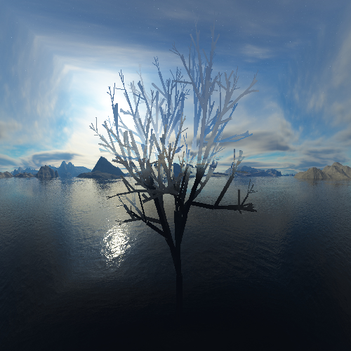

## How to build

*Windows*

Open git bash to the directory containing this repository.

```
mesh-viewer $ mkdir build
mesh-viewer $ cd build
mesh-viewer/build $ cmake ..
mesh-viewer/build $ start mesh-viewer.sln
```

Your solution file should contain two projects: `mesh-viewer` and `test-ply-mesh`.
To run from the git bash command shell, 

```
mesh-viewer/build $ ../bin/Debug/test-ply-mesh.exe
mesh-viewer/build $ ../bin/Debug/mesh-viewer.exe
```

*macOS*

Open terminal to the directory containing this repository.

```
mesh-viewer $ mkdir build
mesh-viewer $ cd build
mesh-viewer/build $ cmake ..
mesh-viewer/build $ make
```

To run each program from build, you would type

```
mesh-viewer/build $ ../bin/mesh-viewer
```

## Demo of basic features

1. Normals shading
<div style="display:flex;">
    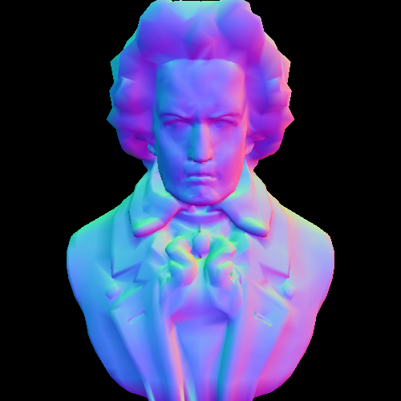
    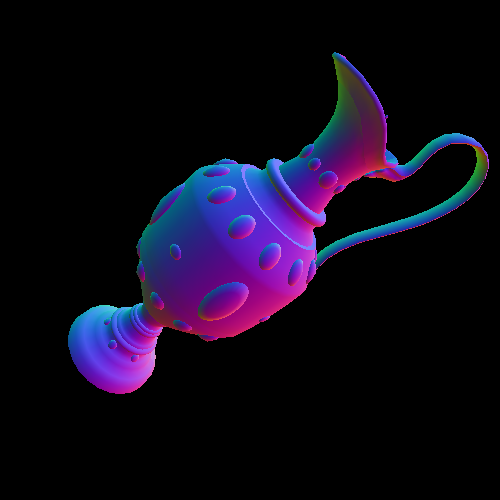
</div>
2. Phong per-pixel shading
<div style="display:flex;">
    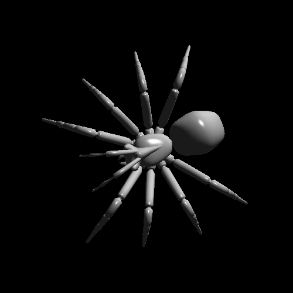
    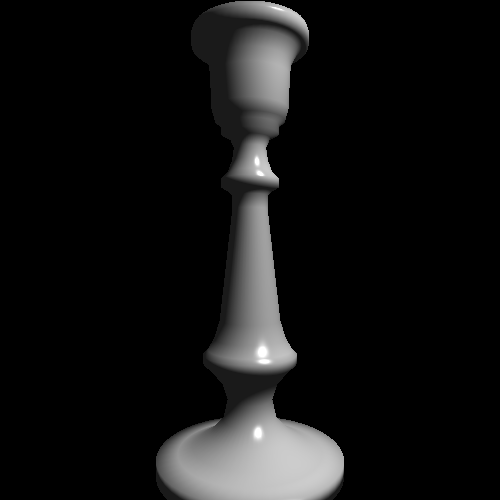
</div>
3. Phong per-vertex shading
<div style="display:flex;">
    
    
</div>

## Unique features 

1. Animated Light
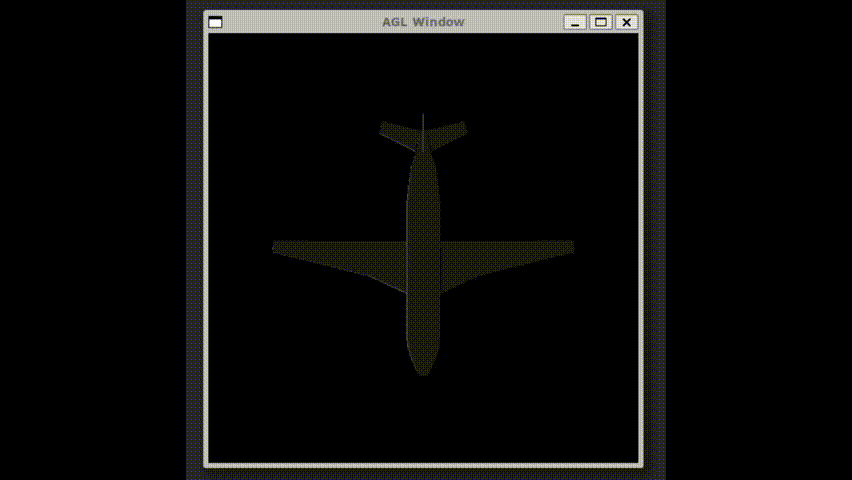
2. Animated Camera

3. Toon shading
<div style="display:flex;">
    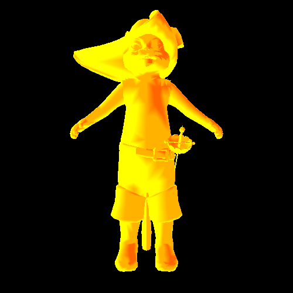
    
</div>
<div style="display:flex;">
    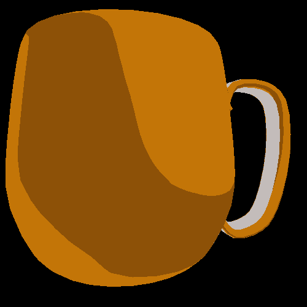
    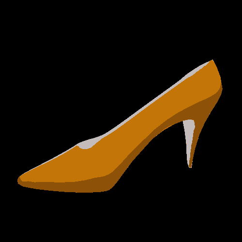
</div>
4. Textures
<div style="display:flex;">
    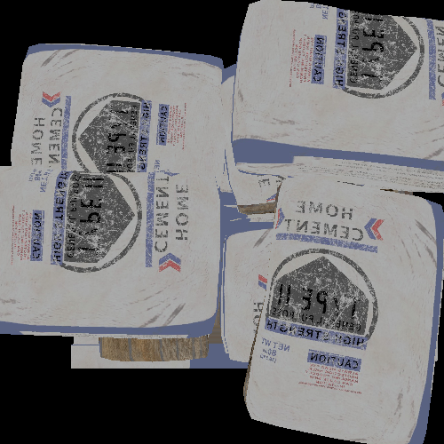
    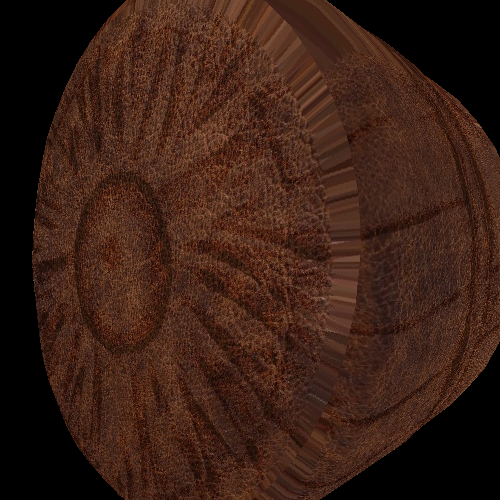
</div>
5. Polka Dot shading + Skybox
<div style="display:flex;">
    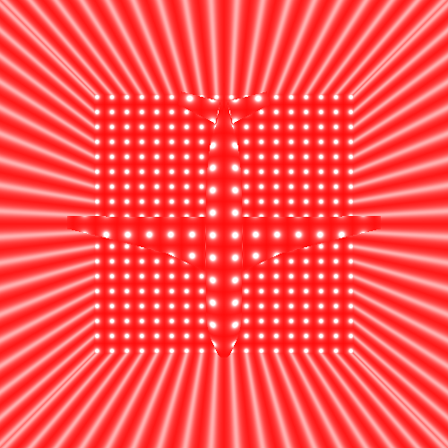
    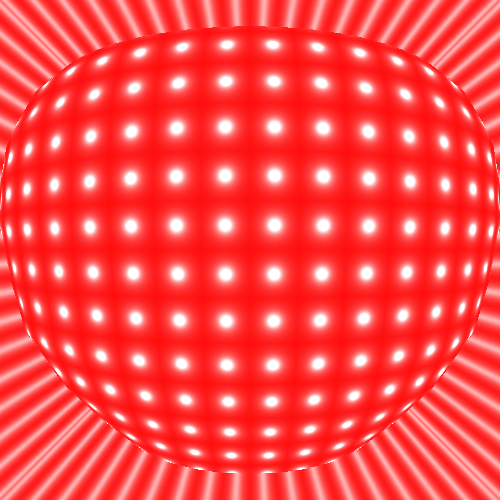
</div>
6. Cubemap shading + Skybox
<div style="display:flex;">
    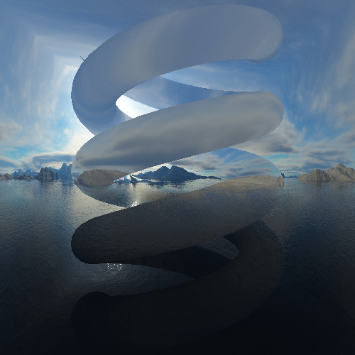
    
</div>
7. Glossy black shading
<div style="display:flex;">
    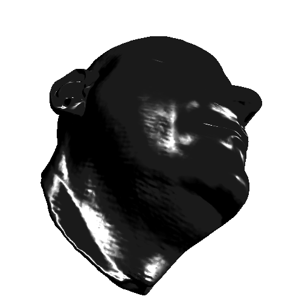
    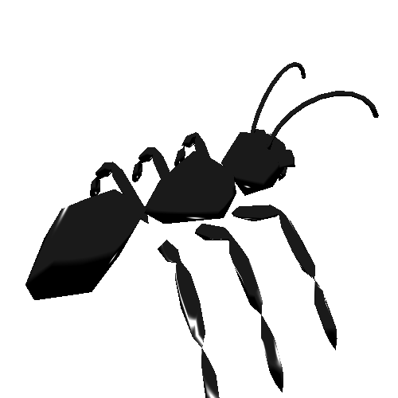
</div>
8. Pulsing vertices
<div style="display:flex;">
    
    
</div>
9. Rippling vertices
<div style="display:flex;">
    
    
</div>
<div style="display:flex;">
    
    
</div>

## Key Bindings

- Next model - N
- Previous model - P
- Next shader - S
- Next texture - T
- Next cubemap - C
- Toggle animated light - L
- Toggle animated camera - E
- Screenshot - X

## Credits

### Models

- "Puss In Boots | Puss In Boots: The Last Wish" (https://skfb.ly/oEQJB) by Sonic Plush Universe is licensed under Creative Commons Attribution (http://creativecommons.org/licenses/by/4.0/).
- "[REMAKE] - Leather Footstool" () by RaynaudL is licensed under Creative Commons Attribution (http://creativecommons.org/licenses/by/4.0/).
- "Concrete bags and pallet" (https://skfb.ly/oELFo) by neverfollow81 is licensed under Creative Commons Attribution (http://creativecommons.org/licenses/by/4.0/).
- "Silver Crafts-Freepoly.org" (https://skfb.ly/oELWo) by Freepoly.org is licensed under Creative Commons Attribution (http://creativecommons.org/licenses/by/4.0/).
- "Cat with jet pack" (https://skfb.ly/oELNA) by Muru is licensed under Creative Commons Attribution (http://creativecommons.org/licenses/by/4.0/).
- "Full body scan" (https://skfb.ly/oELNA) by Artec 3D is licensed under Creative Commons Attribution (http://creativecommons.org/licenses/by/4.0/).
- "Measuring tape" (https://skfb.ly/oELNA) by Artec 3D is licensed under Creative Commons Attribution (http://creativecommons.org/licenses/by/4.0/).
- "Face" (https://www.artec3d.com/3d-models/face) by Artec 3D is licensed under Creative Commons Attribution (http://creativecommons.org/licenses/by/4.0/).
- "Forest Background - panorama" (https://www.cleanpng.com/png-equirectangular-projection-3d-computer-graphics-de-4995986/download-png.html) by Avadu
- "Sea cubemap" (https://learnopengl.com/Advanced-OpenGL/Cubemaps)

